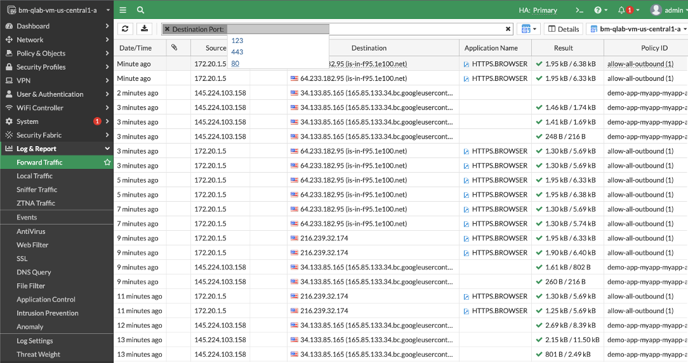
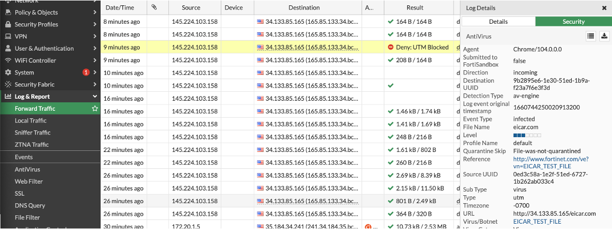
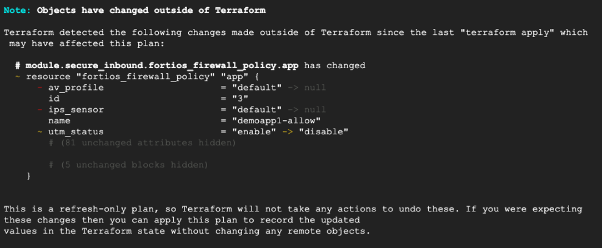

# FortiGate: Automating deployment and configuration using Terraform
## Overview
This lab is intended for network administrators looking to integrate firewall management with DevOps practices and workflow. First part of the lab focuses on deploying a pair of FortiGate virtual appliances using Terraform and bootstrapping their configuration to automatically build a multi-zone HA cluster. Second part deploys a simple web application and leverages fortios terraform provider to include FortiGate configuration changes necessary to protect that application.

All deployments and configuration are driven entirely by terraform code and do not require interactive log-in to FortiGate

### Objectives
In this lab you will:
* Deploy a standard FortiGate HA cluster into Google Cloud using Terraform
* Verify bootstrapping of FortiGate VMs and forming an HA cluster correctly
* Learn how to share data between Terraform deployments
* Deploy a simple web application and reconfigure firewalls to allow traffic to it
* Verify the traffic is passing through the firewall and is protected
* Detect and correct FortiGate configuration drift
* Delete the application and associated firewall configuration

### Setup and requirements

## Task 1: Cloning repository
This lab is fully automated using [Terraform by Hashicorp](https://www.terraform.io/). Terraform is one of the most popular tools for managing cloud infrastructure as code (IaC). While each cloud platform offers its own native tools for IaC, Terraform uses a broad open ecosystem of providers allowing creating and managing resources in any platform equipped with a proper API. In this lab you will use [google provider](https://registry.terraform.io/providers/hashicorp/google/latest/docs) (by Google) to manage resources in Google Cloud and [fortios provider](https://registry.terraform.io/providers/fortinetdev/fortios/latest/docs) (by Fortinet) to manage FortiGate configuration.

All code for this lab is hosted in a public git repository. To use it start by creating a local copy of its contents.
1.	Run the following command in your Cloud Shell to clone the git repository contents:  
        git clone https://github.com/40net-cloud/qwiklab-fgt-terraform.git
1.	Change current working directory to **labs/day0** inside the cloned repository:  
        cd qwiklab-fgt-terraform/labs/day0


## Task 2: Deploying FortiGate cluster
For Terraform each directory containing **.tf** files is a module. A directory in which you run terraform command is the *root module* and can contain *submodules*. In this lab you will deploy two root modules: **day0** and **dayN** with each of them containing submodules. The module structure of **labs** in the cloned **qwiklab-fgt-terraform** repository looks as follows:
- day0
    - fgcp-ha-ap-lb
    - sample-networks
- dayN
    - app-infra
    - secure-inbound

### Customizing deployment through variables
Before deploying the **day0** module you have an opportunity to customize it. The module expects an input variable indicating the region to use.
1.	Pick a region you like (you can use Google Cloud Region Picker to find one matching your needs). If you cannot decide - use us-central1 for the lowest carbon footprint.
2.	Provide name of your region in the **day0/terraform.tfvars** file:
        region = "us-central1"

### FortiGate cluster deployment
Terraform deployment consists of 3 steps. Execute them now as described below:
1.	In **day0** directory initialize terraform using command  
        terraform init  
    This will make terraform parse your **.tf** files for submodules and providers, and download necessary additional files. Re-run `terraform init` every time you add or remove providers and submodules
2.	Build a terraform plan and save it to **tf.plan** file by issuing command  
        terraform plan -out tf.plan  
    Terraform plan file describes every resource to be created and dependencies between them. Planning phase also connects to every provider and checks the state file to verify if any of the resources described in the code already exist or have changed. You should always verify the output of `terraform plan` to understand what resources will be created, changed or destroyed.
3.	Create the resources according to the plan by issuing command  
        terraform apply tf.plan  
    This command will attempt to create, delete or change the resources according to the plan. If run without providing a plan file `terraform apply` will create a new plan and immediately execute it after confirmation from operator. `terraform apply` should be executed every time after the code or variables change.

After `terraform apply` command completes you will see several output values which will be necessary in later steps. Terraform outputs can be used to provide additional information to the operator.

### Reviewing the deployment
Once everything is deployed you can connect to the FortiGates to verify they are running and formed the cluster properly. In an FGCP (FortiGate Clustering Protocol) high-availability cluster all configuration changes are managed by the primary instance and automatically copied to the secondary. You can manage the primary instance using your web browser – the web console is available on standard HTTPS port – or via SSH. You will find the public IP address of your newly deployed FortiGate as well as the initial password in the terraform outputs.

1.	Select the value of `default_password` terraform output to copy it to clipboard
2.	Click the `primary_fgt_mgmt` URL in the outputs to open it in a new browser tab
3.	Log in as user `admin` with password from your clipboard
4.	Change the initial password to your own
5.	Login with your new password
6.	Skip through dashboard configuration, possible firmware upgrade offer and the welcome video
7.	Ignore the red FortiCare Support warning in the dashboard. It informs you that your support contract was not registered. Support contract is not available for this lab.
8.	In the menu on the left select **System > HA**  
    In the table you should see two FortiGate instances with different serial numbers and roles marked as “Primary” and “Secondary”. Initially, the secondary instance might be marked as “Out of sync”, but you can continue without waiting for the cluster to synchronize the configuration.

> Note: At this point you have a fully functional cluster of FortiGates ready to protect traffic sent through it. In the next section you will deploy a web application, create a new public address for it, and redirect the traffic through FortiGate firewalls.

## Task 3: Deploying demo application
In this step you will create a new VM and configure it to host a sample web page. While in the production deployments servers are usually deployed to a separate VPC network or even separate projects, this lab creates a single web server VM directly in the same internal subnet to which second network interface of the firewall is connected.

To deploy the sample web application go back to the cloud shell and issue the following commands:
1.	`cd ../dayN`
2.	`terraform init`
3.	`terraform plan –out tf.plan`
4.	`terraform apply tf.plan`

This time you didn’t have to provide any variables to terraform, because all necessary values (including the region you selected for **day0** module) were automatically pulled by terraform. The possible mechanisms for sharing data between multiple terraform deployments are described in the next section.

### Sharing data between terraform deployments
It is a common scenario where the cloud environment is built in a series of multiple separate deployments. This approach allows to limit the blast radius and makes the code more manageable (often by different teams). In this lab we use a base firewall deployment which in real life would be usually managed by NetSecOps team and a web application deployment managed typically by the application DevOps team. As our goal is to have the application deployment trigger changes to the firewall configuration, both deployments will have to share some common data like the identifiers of firewall-related resources or the FortiGate API access token. There are multiple ways to share this information:

#### Option 1: terraform state file
Terraform saves the current state of the deployment into a state file. State contains all the data terraform needs to link a resource described in the code with its instantiation in the cloud (which doesn’t have to be obvious, as sometimes the name you assign to the resource will not uniquely identify it). It also contains the values of all outputs of your deployment. While it’s a good practice to save the state files in one of multiple available cloud vaults or cloud storage backends available, in this lab we use a simplified approach and save it to a local file on the cloud shell instance disk.

State files can be read, parsed and imported by terraform using the following code used in dayN/import-day0.tf file:
```
data "terraform_remote_state" "day0" {
  backend = "local"

  config  = {
    path = "../day0/terraform.tfstate"
  }
}
```
you can later reference the retrieved output values as shown in **dayN/main.tf**:
```
module "app" {
[...]
  subnet       = data.terraform_remote_state.day0.outputs.internal_subnet
  region       = data.terraform_remote_state.day0.outputs.region
}
```
Note, that while `terraform_remote_state` data block gives access only to the output values, the state file itself contains data you should always treat as confidential and protect as such.

#### Option 2: Secret Manager
Similar to pulling information about the resources from the state file, you can utilize a service specifically designed to store secrets: [Secret Manager](https://cloud.google.com/secret-manager). Using Secret Manager allows building permissions around the CI/CD pipeline, which will make the secret value available to the pipeline, but not to any human operators. As an example we use Secret Manager to store and retrieve the FortiGate API access token:

Created and saved in **day0/fgcp-ha-ap-lb/main.tf**:
```
resource "google_secret_manager_secret" "api-secret" {
  secret_id      = "${google_compute_instance.fgt-vm[0].name}-apikey"
}
resource "google_secret_manager_secret_version" "api_key" {
  secret         = google_secret_manager_secret.api-secret.id
  secret_data    = random_string.api_key.id
}
```

and later retrieved in dayN/providers.tf:  
```
data "google_secret_manager_secret_version" "fgt-apikey" {
  secret         = "${data.google_compute_instance.fgt1.name}-apikey"
}
```

#### Option 3: no sharing
You should always make sure you really need to share any data between modules. Terraform offers a possibility to query the APIs for needed values using its data blocks. You should consider using data instead of sharing variables especially for data that might change over time. For example: if management IP addresses are ephemeral, they may easily drift away from the values known right after initial deployment. The code retrieving the information about primary FortiGate directly from Google Compute API can be found in **dayN/providers.tf**:

```
data "google_compute_instance" "fgt1" {
  self_link = data.terraform_remote_state.day0.outputs.fgt_self_links[0]
}
```

And the current public IP of management interface (port4) used later in the same file:

```
provider "fortios" {
  hostname = data.google_compute_instance.fgt1.network_interface[3].access_config.nat_ip
}
```

### Verifying the complete setup
Terraform **dayN** module deployed the web application and configured FortiGate to allow secure access to it. The steps below will help you verify and understand the elements of this infrastructure:

1.	Verify that the website is available by clicking the application URL from terraform outputs. A sample webpage should open in a new browser tab. If it’s not available immediately retry after a moment. It takes about a minute for the webserver to start. You should see a simple web page similar to this one:

2.	You can now go back to FortiGate web console and use the menu on the left to navigate to Log & Report > Forward Traffic. You will find connections originating from your computer's public IP with destination set to the IP address of the application (which is the address of the external network load balancer). You can click Add Filter and set Destination Port: 80 to filter out the noise.

3.	In the next step you will verify that FortiGate threat inspection is enabled by attempting to download Eicar - a non-malicious malware test file. Click “Try getting EICAR” button in the middle of the demo web page. Your attempt will be blocked.
4.	In the FortiGate web console refresh the Forward Traffic log to show new entries. One of them will be marked as “Deny: UTM blocked”. Double-click the entry and select “Security” tab in the Log Details frame to show details about the detected threat.


> In this section you performed tests to verify the newly deployed application is properly deployed and protected against threats by FortiGate next-gen firewall.

## Task 4: Configuration drift
It can happen that the resources managed by the terraform code are changed manually. After such a change the code, state file and the real configuration are not aligned. It certainly is not a desired situation and is called a “drift”. In this section you will introduce a FortiGate configuration drift and use terraform to fix it.

1.	Connect to FortiGate web console and use menu on the left to navigate to **Policy & Objects > Firewall Policy**. Double-click the **demoapp1-allow** rule in **port1-port2** section, disable all security profiles and save the policy by clicking **OK** button at the bottom.
2.	In the **dayN** directory in Cloud Shell run the following command:  
        terraform plan -refresh-only  
    The `-refresh-only` parameter instructs terraform to only indicate the changes but not plan them or update the state.  
    
3.	To remediate this drift and revert to the configuration described in the terraform file run the   
        terraform apply  
    command. You can refresh the firewall policy list in FortiGate web console to verify the security profiles were re-enabled.
4.	Mind that not all configuration changes will be detected. To check it, while in FortiGate Firewall Policy list delete the **allow-all-outbound** policy in **port2-port1** section and run again the terraform plan `-refresh-only` command. This time there was no drift detected.  
      
    The reason for this behavior is that only part of FortiGate configuration is managed by terraform. The deleted policy was part of the bootstrap configuration applied during initial firewall deployment (you can find it in **day0/main.tf** file, module “fortigates” block, fgt_config variable).

In many organizations mixing manual and managed configuration is not desired. It provides flexibility but requires extra care when these two types of configuration overlap. Remember that parts of configuration created manually will not be automatically visible to terraform.

### Congratulations!
Congratulations, you have successfully deployed and configured FortiGates in Google Cloud using terraform. The skills and concepts you have learned can help you build secure environments leveraging network security experience of FortiGuard Labs combined with cloud-native workflows, eliminating the requirement to interactively log into the firewall management console.

##  Clean-up
To revert changes and remove resources you created in this lab do the following:
1.	To delete the demo application: in the Cloud Shell, issue the following command while in dayN directory:  
        terraform destroy  
    confirm your decision to delete the resources by typing `yes`
2.	In the Cloud Shell go to the day0 directory:  
        cd ../day0  
    and delete the remaining resources using  
        terraform destroy
